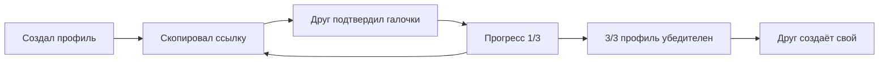
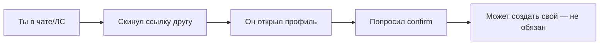
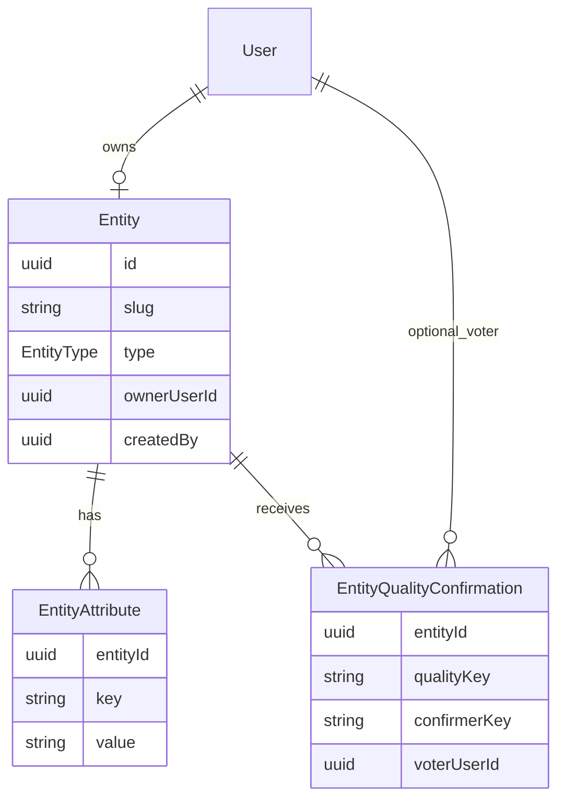
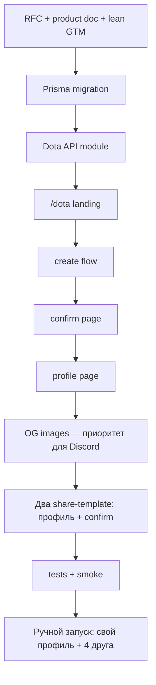

# Dota Vertical MVP — документация и реализация

## Контекст

Продукт позиционируется как **репутация игрока**, не поиск тиммейтов.

### Реальность запуска (0 пользователей)

- **Каналы:** чат в Dota + ЛС в Discord. Никаких массовых каналов, Product Hunt, своего Discord-сервера на старте.
- **Темп:** не вирусный взлёт, а ручной обход — 5–15 контактов в день, недели на первые 20–30 профилей.
- **Главная задача MVP:** чтобы ссылка из чата/ЛС открывалась, выглядела нормально (OG), confirm занимал <30 сек, а создатель понимал что делать дальше.
- **Вирусный loop — бонус, не опора.** На старте confirm'ы будут в основном от тех, кому ты сам напишешь «подтверди». Органический share появится позже, когда у кого-то будет 2/3 и захочется добить.

Цикл (долгосрочно):



На неделе 1–2 параллельно идёт **ручной цикл**:



В коде уже есть [`EntityType.person`](apps/api/prisma/schema.prisma), [`findEntityBySlug`](apps/api/src/modules/entities/services/entities.service.ts), рейтинги/отзывы, паттерн вертикали ai-tools. Нет: `ownerUserId`, кастомных атрибутов, подтверждений качеств, slug-роутов на web, email-уведомлений ([`NotificationsModule`](apps/api/src/modules/notifications/notifications.module.ts) пустой).

---

## Часть 0 — Документация (перед кодом)

### RFC 0015: Person Entities & Quality Confirmations

Файл: [`docs/11-rfc/0015-person-entities-and-quality-confirmations.md`](docs/11-rfc/0015-person-entities-and-quality-confirmations.md)

Содержание:
- **Problem**: Опиния оценивает объекты, но не людей; нет механики репутации с низким friction
- **Decision**: `User` (аккаунт) владеет `Entity(type=person)` (публичная репутация)
- **Data model** (см. диаграмму ниже)
- **Quality confirmations**: one-click, без регистрации; анти-накрутка через fingerprint + rate limit
- **Verticals**: атрибут `vertical=dota` на person; маршрут `/dota/*` — изолированный вход
- **Out of scope v1**: поиск, LFG, Steam OAuth, red flags, текстовые отзывы, email
- **Security**: 1 person на user; нельзя создавать person чужих людей; self-confirm запрещён

### Product doc: Dota Vertical

Файл: [`docs/product/dota-vertical.md`](docs/product/dota-vertical.md)

Содержание:
- Позиционирование: «профиль с подтверждениями от тиммейтов», не «поиск»
- User flows: создание → share → confirm → возврат по прогрессу
- **Copy для ручного запуска** (см. ниже «Lean GTM»)
- Этапы роста: Репутация → Активность (LFG) → Сеть (поиск)
- MVP scope checklist и **реалистичные метрики** на 2–4 недели
- OG/preview требования — **приоритет #1 для Discord ЛС**

### Lean GTM (внутри dota-vertical.md, без отдельного marketing-doc)

Не делаем на старте: `.agents/product-marketing.md`, community, A/B-тесты, programmatic SEO, рекламу, email-цепочки. Всё умещается в product doc.

**Позиционирование (one-liner для чата):**
> «Профиль дотера — тиммейты ставят галочки: не токсик, есть мик, норм колл. Не стата, не LFG.»

**Скрипты для Dota-чата** (короткие, без спама — после катки или в party chat):
- «сделал профиль с подтверждениями от тиммейтов, киньте галочки если играли со мной: [ссылка]»
- «кто со мной в пати — подтвердите тут, 10 сек: [ссылка на /confirm]»

**Скрипты для Discord ЛС** (персонально, не массовая рассылка):
- «запустил штуку — профиль с галочками от тех с кем играл. можешь подтвердить? [ссылка]»
- После confirm: «спасибо. если хочешь свой — [ссылка на /dota]»

**Возражения (коротко):**
| Возражение | Ответ |
|------------|-------|
| «Зачем?» | «Чтобы не объяснять в чате что ты норм — ссылка говорит сама» |
| «Никто не подтвердит» | «Нужно 3 человека с кем реально играл — не весь сервер» |
| «Очередной профиль» | «Тут не стата — только то что друзья подтвердили руками» |

**Цели на первые 2–4 недели (ручной запуск):**

| Неделя | Цель | Сигнал «работает» |
|--------|------|-------------------|
| 1 | 5 профилей (свой + 4 друга) | Хотя бы 1 confirm без твоего пинга |
| 2 | 15 профилей, ~30 confirm | Кто-то сам скинул ссылку в чат |
| 3–4 | 30 профилей | 1 confirmer создал свой профиль |

Если к концу недели 2 ноль органических confirm — проблема в copy или friction, не в «мало рекламы».

**Ручной учёт (таблица в Notion/Sheets, пока мало данных):**
- Дата, канал (dota chat / discord ЛС), кому, открыл?, confirm?, создал профиль?
- Достаточно до ~50 событий; потом подключаем события в коде

**Минимальный трекинг в продукте** (todo `analytics-lite`):
- `dota_profile_created`
- `dota_share_copied`
- `dota_confirmation_submitted`
- `dota_confirmer_signup_started` (клик «создай свой» на confirm)
- Опционально: `?ref={slug}` на confirm-ссылке для атрибуции «кто привёл»

GA4/GTM — только если уже есть в проекте; иначе таблица + логи API на первый месяц.

### Обновить индекс

- [`docs/README.md`](docs/README.md) — добавить RFC 0015 и product doc

---

## Часть 1 — Схема данных

Миграция Prisma в [`apps/api/prisma/schema.prisma`](apps/api/prisma/schema.prisma):



### Таблицы

**`entities.entities`** — новое поле:
- `owner_user_id` UUID nullable, unique (partial: where type=person AND owner_user_id IS NOT NULL)
- Индекс на `owner_user_id`

**`entities.entity_attributes`** (новая):
- `entity_id`, `key`, `value` (text/json string)
- unique `(entity_id, key)`
- Ключи для Dota MVP: `vertical`, `dota_account_id`, `mmr`, `roles`, `server`, `language`, `has_mic`, `play_intent`
- **`dota_account_id`** — Dota Friend ID / Account ID (цифры из клиента); unique среди `vertical=dota`; для поиска в игре
- **`mmr`** — self-reported, подпись «указано игроком»; без OpenDota/Steam в MVP

**`entities.entity_quality_confirmations`** (новая):
- `entity_id`, `quality_key`, `confirmer_key` (hash cookie/IP), `voter_user_id` nullable
- unique `(entity_id, quality_key, confirmer_key)` — один человек не накручивает один флаг дважды
- Ключи: `has_mic`, `chill`, `good_caller`, `stress_resistant`, `good_support` (green only в MVP)

**`users.users`** (фаза 2, не MVP-blocker):
- `last_seen_at` — для «был недавно»

### Бизнес-правила

| Правило | Реализация |
|---------|------------|
| 1 person на user | unique `owner_user_id` + check в service |
| Только свой person | `owner_user_id = currentUser.id` при create/update |
| Self-confirm запрещён | confirmer_key ≠ owner fingerprint; logged-in voter ≠ owner |
| Прогресс 0/3 | count distinct `confirmer_key` per entity (не count flags) |
| Vertical isolation | `vertical=dota` attribute обязателен для `/dota/*` routes |
| 1 Dota ID на профиль | unique `(dota_account_id)` where vertical=dota; второй юзер не может занять чужие цифры |
| Dota ID без верификации | бейдж «не подтверждён» до Steam OAuth (стадия 1.5); в MVP — честность + confirm от тиммейтов |

### Идентификация в Dota (как находят профиль)

В игре люди не шарят slug — они знают **цифры** (Dota Account ID / Friend ID в профиле клиента). Два канала discoverability:

| Способ | Когда | MVP |
|--------|-------|-----|
| **Ссылка** | Discord ЛС, party chat | Основной — copy-to-clipboard |
| **Цифры** | «Какой у тебя ID?» после катки | `/dota/id/{accountId}` → редирект на профиль |
| **Поиск на лендинге** | Кто-то скинул ID в чат | Поле «введи Dota ID» на `/dota` |

**Что пишет игрок сам (MVP):**
- **Dota Account ID** — обязательно при создании; подсказка «где найти в клиенте» + валидация формата (только цифры, 8–10 знаков)
- **MMR, роли, сервер** — вручную; явно помечать «указано игроком», не «с OpenDota»
- **Ник в Dota** — опционально в title/slug; ник меняется, на него не опираться для поиска

**Что НЕ делаем в MVP:**
- Автоподтягивание MMR/ранга из API — стадия 1.5 (Steam OAuth + OpenDota)
- Поиск по MMR/ролям — стадия 3, когда есть плотность

**Copy для чата с цифрами:**
- «мой dota id 123456789, профиль: reviewo.ru/dota/id/123456789»
- Третья кнопка copy: **ID + короткая ссылка** — для тех, кто привык искать по цифрам

**Риск имперсонации:** без Steam любой может занять чужой ID → unique constraint + жалобы позже; долгосрочно Steam login = verified badge.

---

## Часть 2 — Backend API

Новый модуль: `apps/api/src/modules/dota/` (вертикаль-специфичный фасад; позже обобщается в `people/`).

| Method | Path | Auth | Назначение |
|--------|------|------|------------|
| POST | `/dota/profiles` | JWT | Создать person-профиль + атрибуты |
| GET | `/dota/profiles/me` | JWT | Свой профиль + прогресс |
| PATCH | `/dota/profiles/me` | JWT | Обновить атрибуты |
| GET | `/dota/profiles/:slug` | public | Публичный профиль + агрегаты флагов |
| GET | `/dota/profiles/by-id/:accountId` | public | Resolve по Dota Account ID → slug/profile |
| POST | `/dota/profiles/:slug/confirm` | public | Отправить выбранные quality keys |
| GET | `/entities/slug/:slug` | public | **Общий** slug lookup (нужен web redirect) |

Ключевые файлы для переиспользования:
- [`EntitiesService.createEntity`](apps/api/src/modules/entities/services/entities.service.ts) — базовое создание
- [`EntitiesRepository.findBySlug`](apps/api/src/modules/entities/repositories/entities.repository.ts)
- Rate limiting: паттерн из [`write-rate-limit-rules.ts`](apps/api/src/common/rate-limiting/write-rate-limit-rules.ts)

**DotaProfileService** логика:
- Create: `type=person`, `vertical=dota`, slug из username или title, `ownerUserId=currentUser.id`
- Confirm: принять массив `qualityKeys[]`, записать confirmations, вернуть обновлённый count
- Aggregates: `{ qualityKey: count }` + `distinctConfirmers: N` + `milestones: { target: 3, current: N }`

**Анти-накрутка** (MVP):
- `confirmer_key` = hash(`visitorId` cookie || IP + UA)
- Rate limit: max 10 confirmations/hour per IP
- Max 1 confirmer per entity per 24h для anonymous (опционально)

**Domain event** (задел на уведомления):
- `quality.confirmation.created` → payload `{ entityId, ownerUserId, distinctConfirmers }`
- Handler пока только логирует; email — отдельный этап

---

## Часть 3 — Frontend

Новые маршруты в [`apps/web/src/app/`](apps/web/src/app/):

| Route | Компонент | Назначение |
|-------|-----------|------------|
| `/dota` | landing | «Создай профиль» + **поиск по Dota ID** |
| `/dota/create` | wizard | Dota ID, MMR, роли, сервер, мик — после auth |
| `/dota/id/[accountId]` | redirect | Короткий вход по цифрам → `/dota/[slug]` |
| `/dota/[slug]` | profile | Публичный профиль + **Dota ID крупно** + copy |
| `/dota/[slug]/confirm` | confirm | Галочки без регистрации + CTA «создай свой» |

Фича-папка: `apps/web/src/features/dota/`

**Не переиспользуем** generic [`EntityPageView`](apps/web/src/features/entity-page/components/entity-page-view.tsx) для MVP — person/Dota UI другой (нет canonical URL, hostname, extension CTA). Общие куски: auth, API client, i18n.

### Ключевые экраны

**После создания** (`/dota/[slug]?created=1`):
```
Репутация: недостаточно данных (0/3)
[ Скопировать ссылку ]  ← готовый текст для Discord ЛС и Dota-чата
[ Скопировать ссылку на confirm ]  ← короче, для «подтверди тут»
[ Скопировать Dota ID ]  ← «id 123456789 — reviewo.ru/dota/id/123456789»
□ Dota ID ✓  □ MMR ✓  □ Роли ✓  □ 3 подтверждения
```

Три варианта copy в clipboard: **профиль**, **confirm**, **по цифрам** — под разные каналы.

**Confirm page** (`/dota/[slug]/confirm`):
- Список quality toggles (one tap each)
- Кнопка «Подтвердить» — один POST
- Footer: «Хочешь такой же профиль?» → `/dota/create`

**Profile page** (`/dota/[slug]`):
- Hero: nickname, **Dota ID** (copy), MMR «указано игроком», roles
- Quality bars: `✅ Не токсик — 3 подтверждения`
- Owner видит прогресс и share CTA
- OG metadata: MMR + top 3 qualities (новый route или адаптация [`og/entity`](apps/web/src/app/og/entity/[entityId]/route.tsx))

### i18n

Ключи в [`packages/i18n/src/messages/ru.ts`](packages/i18n/src/messages/ru.ts) и `en.ts` — quality labels, landing copy, share templates.

---

## Часть 4 — Что НЕ входит в MVP

| Фича | Когда | Почему |
|------|-------|--------|
| Поиск по MMR/ролям | Стадия 3 | Пустой клуб |
| LFG «ищу игру» | Стадия 2 | Нужен после ~30 профилей и хотя бы 5 органических share |
| Red flags | После green flags | Сначала позитив |
| Текстовые отзывы | После confirmations | Больше friction |
| Steam OAuth + OpenDota | Стадия 1.5 | Верификация Dota ID, авто-MMR; до этого — ручной ввод |
| Email уведомления | После MVP | Нет email infra |
| Ежедневные кредиты | После LFG | Нет use case |
| `dota.opinia.ru` subdomain | Не нужно | `/dota` достаточно |

**Возврат без email (MVP):**
- Прогресс виден на профиле при следующем визите
- Share CTA остаётся на странице пока `< 3` confirmations
- Cookie `dota_visitor_id` для confirmer tracking

---

## Часть 5 — Тесты и smoke

- Unit: `DotaProfileService` — create, confirm, self-confirm block, progress count
- Integration: `POST /dota/profiles` → `POST /dota/profiles/:slug/confirm` → `GET` aggregates
- Web: ручной smoke по [`docs/testing/mvp-smoke-checklist.md`](docs/testing/mvp-smoke-checklist.md) — добавить секцию Dota

---

## Порядок реализации



Оценка кода: **~3-5 дней**. Маркетинг на старте — **0 дней dev**, только copy в product doc + ручные ЛС после деплоя.

---

## Риски

1. **Глобальный slug** — `fivii` уникален на всю платформу; конфликт с website entity маловероятен, но service должен проверять
2. **Накрутка** — на старте не критично; fingerprint + rate limit достаточно
3. **Путаница с generic entity page** — `/entities/:uuid` остаётся; Dota живёт на `/dota/:slug`; не смешивать в навигации главной
4. **Холодный старт** — без seed-профилей loop мёртв; первые 5 профилей — вручную через ЛС, не ждать органики
5. **Спам в чате** — кик/репорт; писать только в party/post-game, не копипастить в all chat каждую катку
6. **Плохое OG в Discord** — ссылка выглядит как мусор → не кликают; OG — не nice-to-have, а blocker для ЛС-канала
