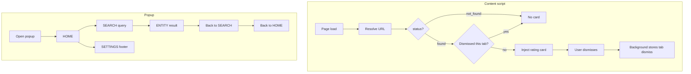

# RFC UX-0001 — Extension Experience Foundation

| Field | Value |
| ----- | ----- |
| Status | **Implemented** |
| Scope | Extension UX only |
| Constraints | No API / DB / backend changes |

## UX analysis

### Current pain

| Area | Today | User impact |
| ---- | ----- | ----------- |
| Content card | Shows for `found` **and** `not_found`; easy to dismiss without memory | Feels like a debug overlay, not product UI |
| Popup | Auth + resolve debug panel | User must open popup to learn page status |
| Search | None in extension | Cannot discover entities without leaving the tab |
| Navigation | Single static view | No sense of app flow |

### Target personas

1. **Casual rater** — visits a site, sees card, rates in one click.
2. **Explorer** — opens popup, searches "github", opens entity page on web.
3. **Returning user** — sees recent entities and account in header/footer.

### Principles

- Auto-show only when value is clear (`found`).
- Popup = small app (home → search → entity).
- Reuse existing API endpoints and content card components.
- Local-only state where backend is not required (recent list, dismissal).

---

## Component tree

```text
extension/
├── content/
│   ├── index.ts                    # resolve → found-only card
│   └── rating-card/                # (existing, reused)
├── background/
│   ├── index.ts
│   └── card-dismissal.ts           # per-tab session dismiss map
└── popup/
    ├── app.ts                      # shell + navigation orchestrator
    ├── navigation.ts               # HOME | SEARCH | ENTITY | SETTINGS stack
    ├── shell.ts                    # header / footer chrome
    ├── screens/
    │   ├── home-screen.ts          # current page, search entry, recent
    │   ├── search-screen.ts        # results list
    │   ├── entity-screen.ts        # entity summary + open web + rate
    │   └── settings-screen.ts      # minimal settings
    ├── services/
    │   ├── active-tab-resolve.ts
    │   ├── search-entities.ts      # GET /search/entities
    │   └── recent-entities.ts    # chrome.storage.local
    └── components/
        └── auth-form.ts            # extracted auth UI
```

---

## State flow



---

## Navigation architecture

| Screen | Entry | Back | Actions |
| ------ | ----- | ---- | ------- |
| **HOME** | Popup open | — | Search input → SEARCH; Open page; Recent → ENTITY |
| **SEARCH** | Home search submit | HOME | Result tap → ENTITY |
| **ENTITY** | Search / recent / home open | SEARCH or HOME | Open web; Rate (found / by-url) |
| **SETTINGS** | Footer | HOME | View build info |

Stack rules (implemented in `navigation.ts`):

- `HOME → SEARCH`
- `SEARCH → ENTITY` (push)
- `ENTITY → back → SEARCH`
- `SEARCH → back → HOME`
- `SETTINGS` replaces body; back returns HOME

---

## Implementation plan

1. **Card policy** — content injects card only for `found`; tab-scoped dismiss in background.
2. **Popup shell** — header (logo + account), body (screen), footer (settings + logout).
3. **Home** — active tab resolve summary, search field, recent entities (local).
4. **Search** — debounced `GET /search/entities`.
5. **Entity** — summary, open web link, rating controls (existing submit helpers).
6. **Settings** — static info; no new backend.
7. **CSS** — widen popup, app-like layout.
8. **Verify** — `pnpm --filter @reviewo/extension build && test`.

No changes to API contracts, schema, or domain services.
